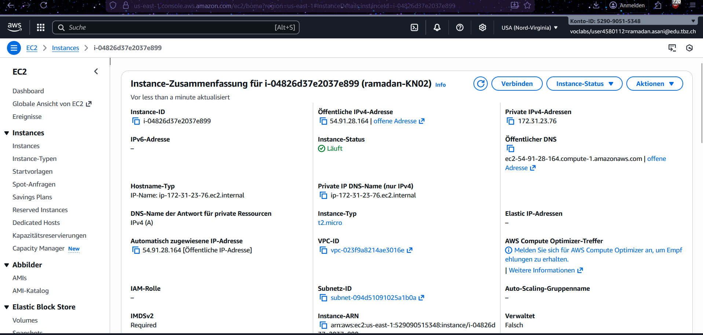
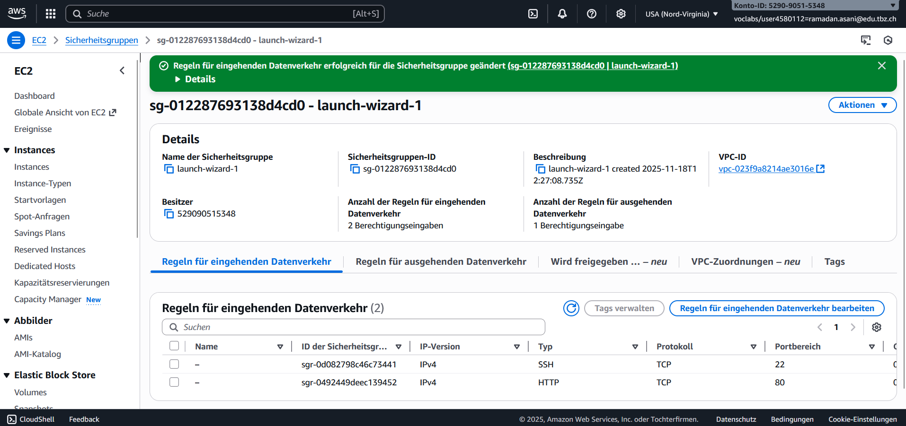
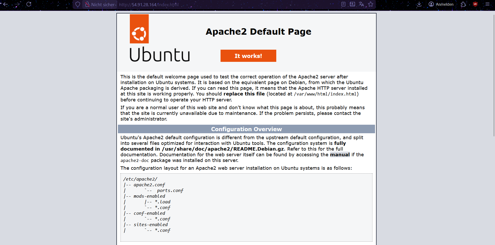
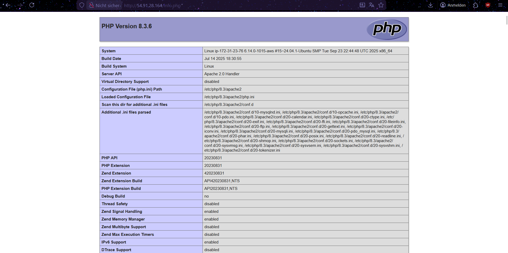
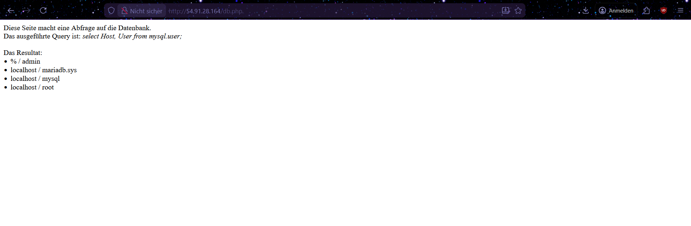
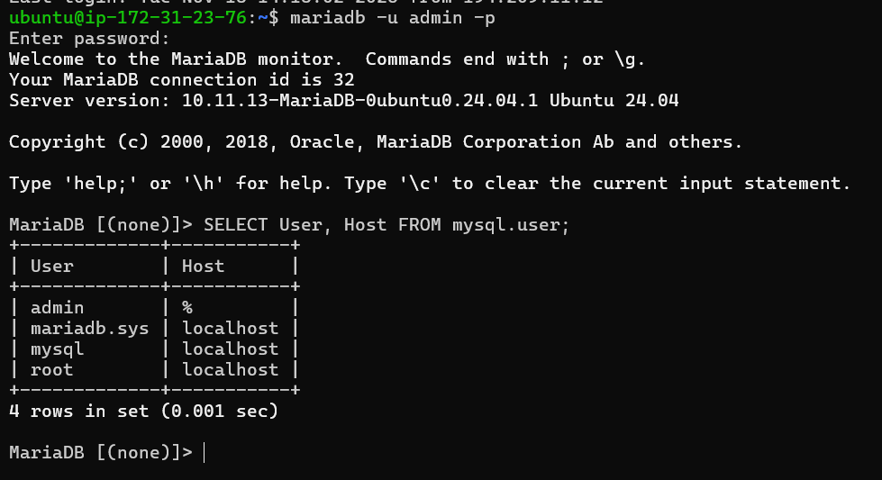

# KN03: IaaS - Virtuelle Server

## Aufgabe A: Installation von Web- und Datenbankserver

**Ziel:** Apache Webserver, PHP und MariaDB auf Ubuntu EC2-Instanz installieren und über HTTP erreichbar machen.

---

## 1. EC2 Instanz Details

Die Instanz wurde erstellt und läuft auf AWS mit öffentlicher IP-Adresse.


*EC2 Instanz: ramadan-KN02 mit öffentlicher IPv4-Adresse: 54.91.28.164*

---

## 2. Security Group Konfiguration

Firewall-Regeln wurden angepasst, um SSH (Port 22) und HTTP (Port 80) zuzulassen.


*Eingehende Regeln: SSH (22) und HTTP (80) erlaubt*

---

## 3. Apache Webserver Test

Apache wurde erfolgreich installiert und ist erreichbar.


*URL: http://54.91.28.164/index.html - Apache läuft*

---

## 4. PHP Modul Test

PHP wurde installiert und funktioniert mit Apache.


*URL: http://54.91.28.164/info.php - PHP Version 8.3.6*

---

## 5. Datenbank-Verbindung Test

MariaDB wurde installiert und die Verbindung funktioniert.


*URL: http://54.91.28.164/db.php - DB-Benutzer werden angezeigt*

---

## 6. MySQL Konsole

Login in MariaDB-Konsole mit Admin-Benutzer und Ausführung der SELECT-Abfrage.


*Befehl: `mariadb -u admin -p` + SQL-Abfrage*

---

## SQL-Abfrage Erklärung

**Abfrage:** `SELECT User, Host FROM mysql.user;`

Diese Abfrage liest alle Benutzernamen (User) und deren erlaubte Verbindungsquellen (Host) aus der Benutzertabelle der MariaDB-Datenbank aus. 

**Resultat:** 4 Benutzer wurden gefunden:
- `admin` mit Host `%` (von überall verbindbar)
- `mariadb.sys`, `mysql`, `root` mit Host `localhost` (nur lokal verbindbar)

---

## Durchgeführte Befehle
```bash
sudo apt update
sudo apt install apache2
sudo apt install php
sudo apt install libapache2-mod-php
sudo apt install mariadb-server
sudo apt install php-mysql
sudo mysql -sfu root -e "GRANT ALL ON *.* TO 'admin'@'%' IDENTIFIED BY '1234' WITH GRANT OPTION;"
sudo systemctl restart mariadb.service
sudo systemctl restart apache2
cd ~
git clone https://gitlab.com/ch-tbz-it/Stud/m346/m346scripts.git
sudo cp ./m346scripts/KN03/*.php /var/www/html/
mariadb -u admin -p
```

**Passwort:** 1234

---