# KN04 - Cloud-init

## Übersicht

In diesem Kompetenznachweis wurde die Automatisierung von Server-Installationen mit Cloud-init demonstriert.

---

## Teil A: Cloud-init Dokumentation

Erstellung einer vollständig dokumentierten Cloud-init Datei mit Kommentaren zu allen Konfigurationsoptionen.

**Datei:** `cloud-init-documented.yaml`

---

## Teil B: SSH-Key Konfiguration

### Ziel

Beweis, dass Cloud-init SSH-Keys korrekt installiert.

### Setup

- **ramadan1**: Via Cloud-init (Benutzerdaten)
- **ramadan2**: Via AWS GUI (Key Pair)

### SSH Public Keys extrahiert

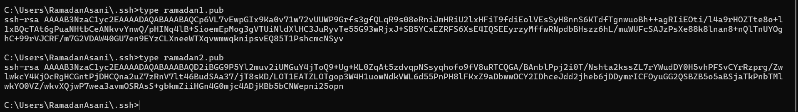

### AWS Schlüsselpaare

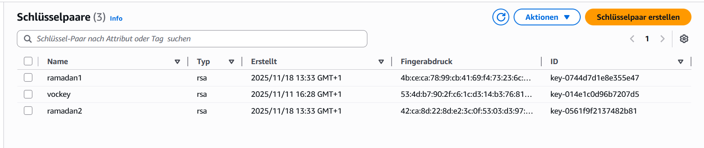

### Cloud-init Benutzerdaten (Teil B)

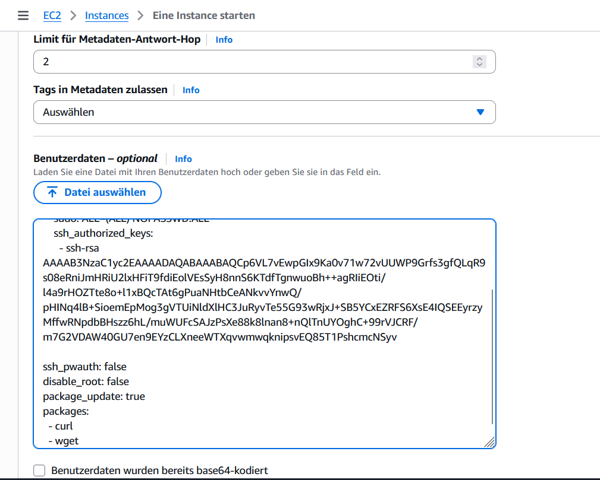

### SSH Login erfolgreich (ramadan1)

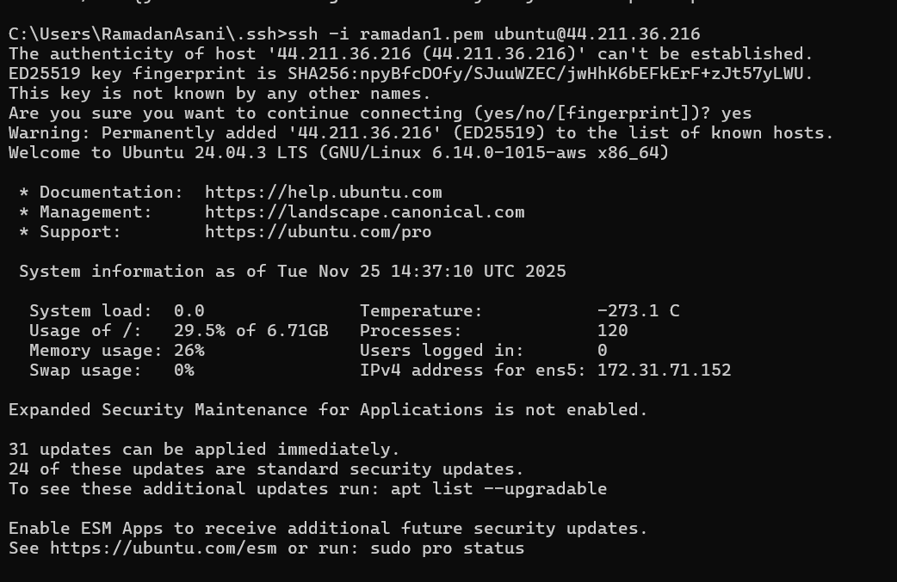

### Cloud-init Log

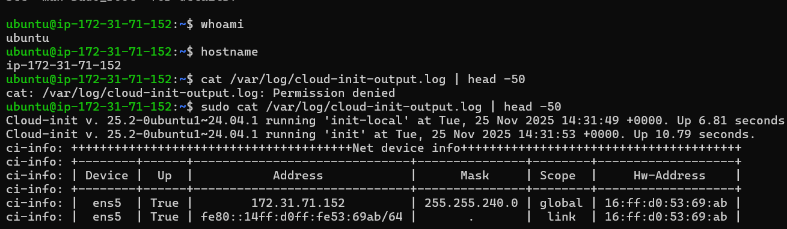

### SSH Login fehlgeschlagen (ramadan2)

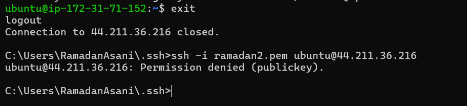

### Ergebnis

| Key      | Methode    | SSH-Login            |
| -------- | ---------- | -------------------- |
| ramadan1 | Cloud-init | ✅ Erfolgreich       |
| ramadan2 | AWS GUI    | ❌ Permission denied |

---

## Teil C: Template

Erstellung eines wiederverwendbaren Templates mit:

- Eigenem SSH-Key (ramadan1)
- Lehrpersonen SSH-Key (NUY)

**Datei:** `cloud-init-template.yaml`

---

## Teil D: DB + Web Server

### Architektur

```
┌─────────────────┐         ┌─────────────────┐
│   Web-Server    │ ──────► │   DB-Server     │
│  100.31.96.80   │  :3306  │  44.213.64.128  │
│  Apache + PHP   │         │    MariaDB      │
└─────────────────┘         └─────────────────┘
```

---

### DB-Server (KN04-DB-Server)

| Eigenschaft | Wert             |
| ----------- | ---------------- |
| Private IP  | 172.31.68.1      |
| OS          | Ubuntu 24.04     |
| Software    | MariaDB 10.11.13 |
| Datenbank   | m347             |
| User        | admin            |
| Port        | 3306             |

#### Security Group (SSH + MySQL)

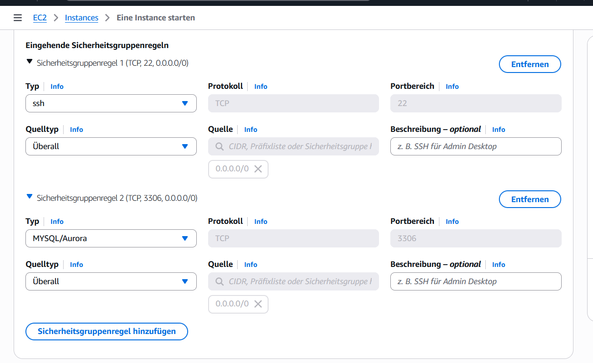

#### Cloud-init Benutzerdaten

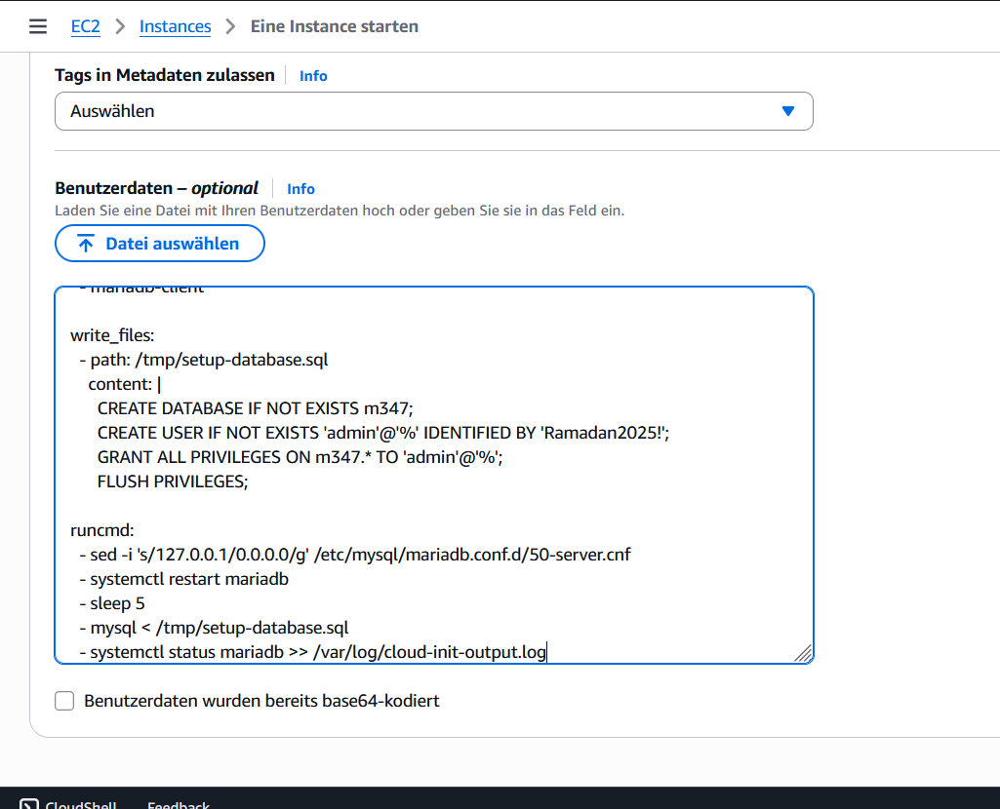

#### Instance Details

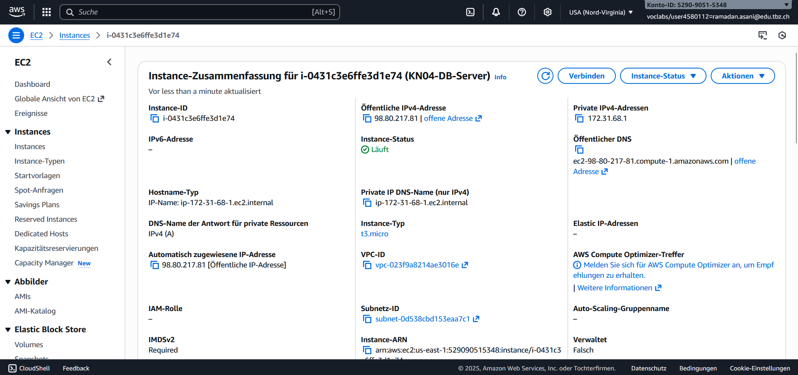

#### MySQL SHOW DATABASES

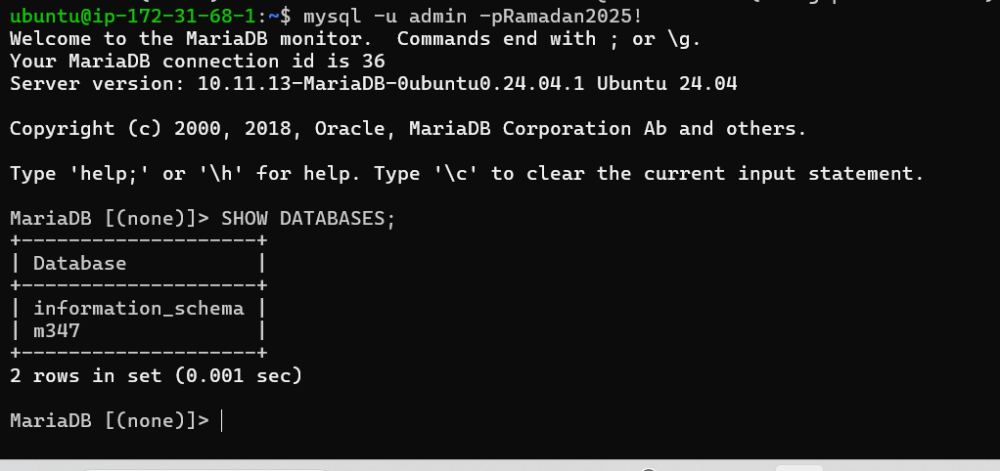

#### DB Konfiguration (bind-address)

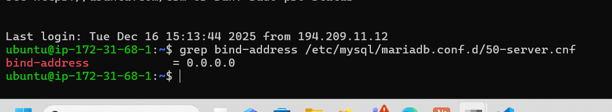

---

### Web-Server (KN04-Web-Server)

| Eigenschaft | Wert                        |
| ----------- | --------------------------- |
| IP          | 100.31.96.80                |
| OS          | Ubuntu 24.04                |
| Software    | Apache2, PHP 8.3.6, Adminer |
| Ports       | 22, 80, 443                 |

#### Security Group (SSH + HTTP + HTTPS)


#### Cloud-init Benutzerdaten

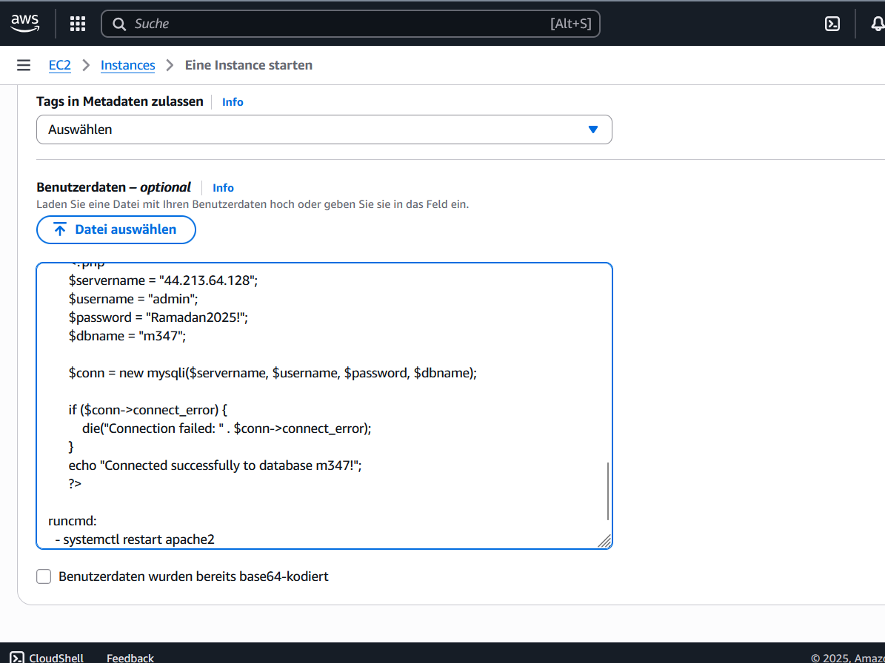

#### Apache Default Page

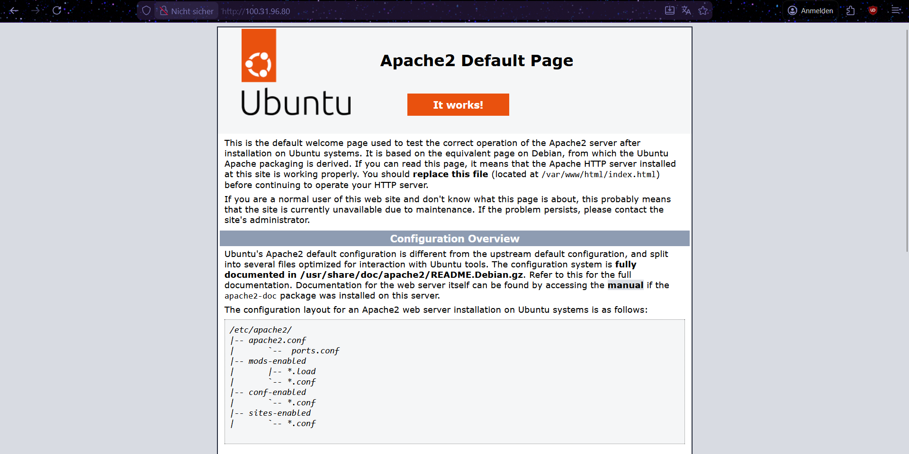

#### PHP Info

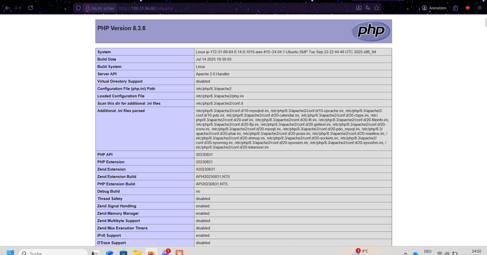

#### Datenbank-Verbindung (db.php)


#### Adminer - Datenbank Administration

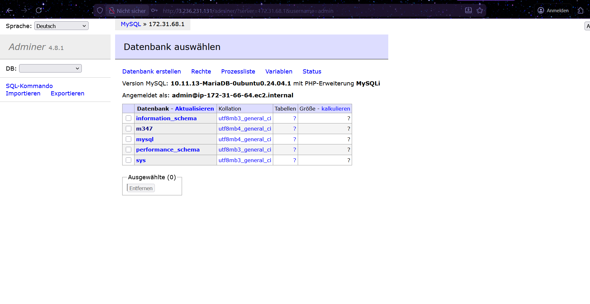

---

### Verbindungstest

**URL:** `http://100.31.96.80/db.php`

**Ergebnis:** `Connected successfully to database m347!`

**Adminer URL:** `http://100.31.96.80/adminer/`

**Ergebnis:** Erfolgreiche Verbindung zur Datenbank m347 über Web-GUI.

---

## Dateien

```
KN04/
├── cloud-init-documented.yaml  (Teil A)
├── cloud-init-with-key.yaml    (Teil B)
├── cloud-init-template.yaml    (Teil C)
├── cloud-init-db.yaml          (Teil D)
├── cloud-init-web.yaml         (Teil D)
├── README.md
└── Bilder/
    ├── Bild1.png
    ├── Bild2.png
    ├── Bild3.png
    ├── Bild4.png
    ├── Bild5.png
    ├── Bild6.png
    ├── Bild7.png
    ├── Bild8.png
    ├── Bild9.png
    ├── Bild10.png
    ├── Bild11.png
    ├── Bild12.png
    ├── Bild13.png
    ├── Bild14.png
    ├── Bild15.png
    ├── Bild16.png
    ├── Bild17.png
    └── Bild18.png
```

---

## Fazit

Cloud-init ermöglicht die vollständige Automatisierung von:

- Benutzer-Erstellung
- SSH-Key Installation
- Paket-Installation
- Konfigurationsdateien
- Service-Starts

Die Verbindung zwischen Web- und DB-Server wurde erfolgreich automatisiert. Mit Adminer kann die Datenbank über eine Web-GUI administriert werden.
