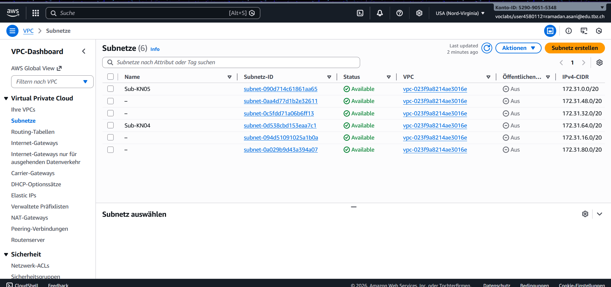
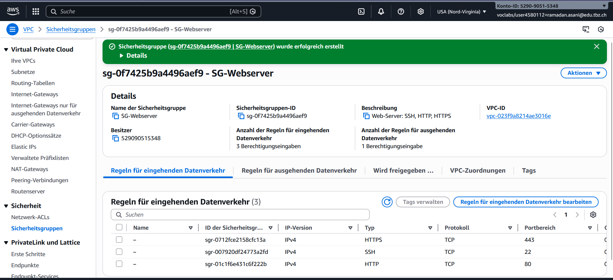
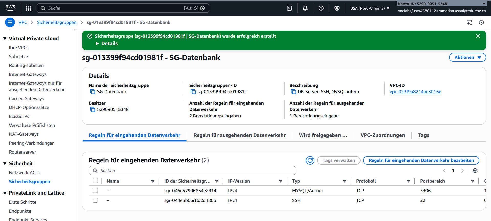
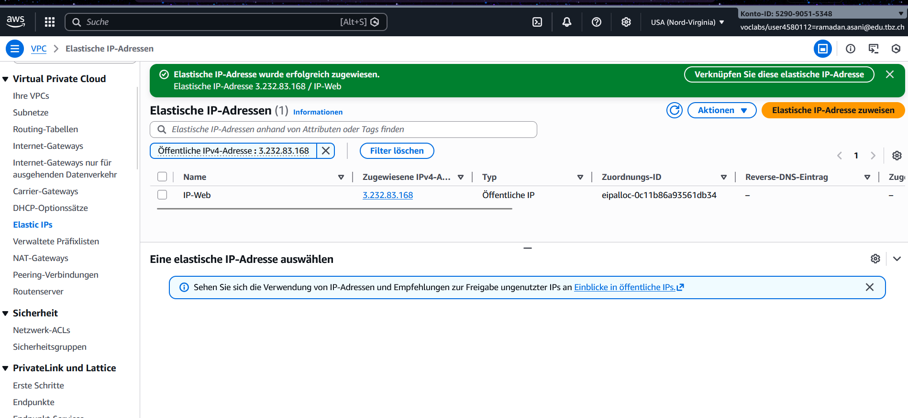
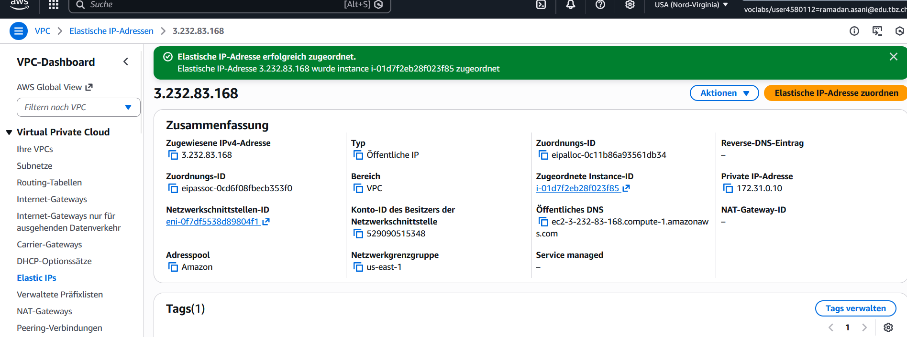
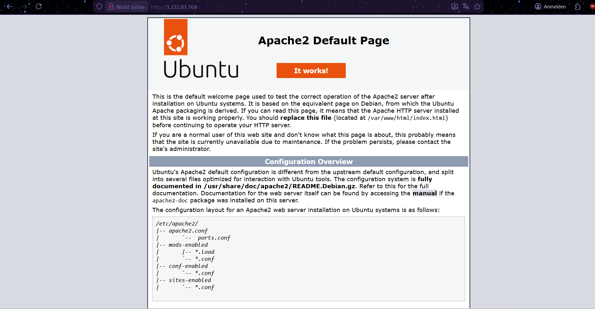
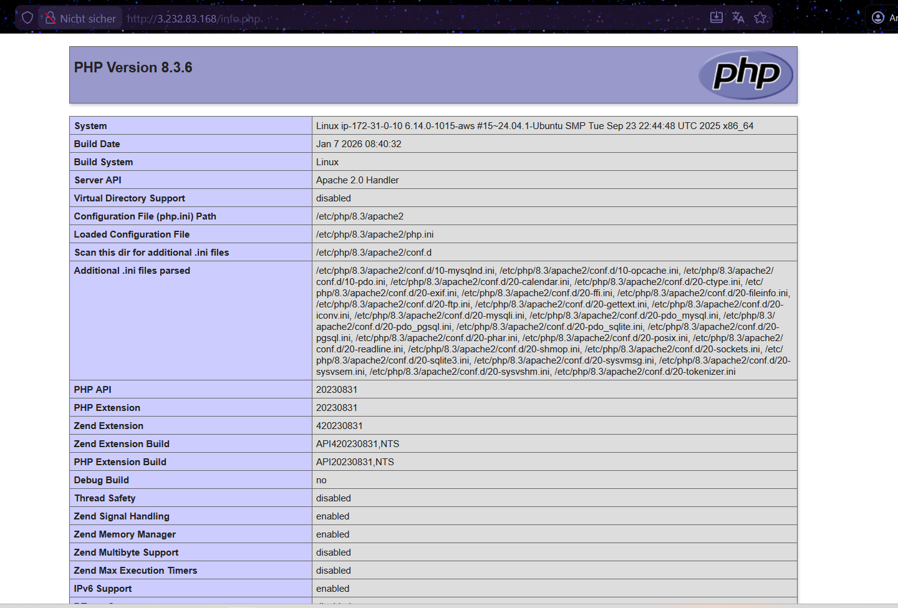
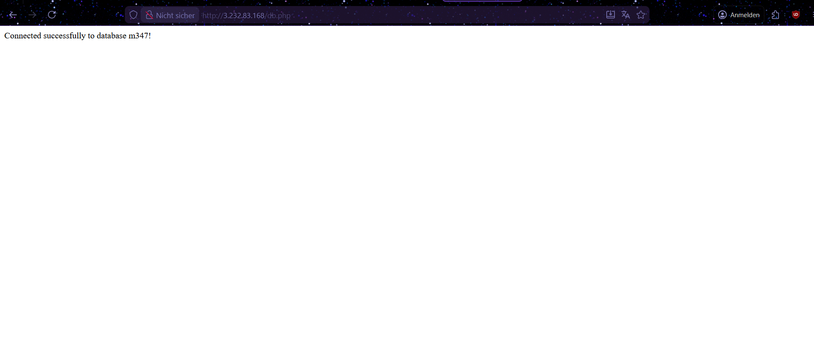

# KN05: Netzwerk / Sicherheit - Abgabe

## A) Grundbegriffe und private IP wählen (30%)

### Erklärung der Begriffe

**VPC (Virtual Private Cloud):**
Eine VPC ist ein isoliertes virtuelles Netzwerk in der AWS-Cloud. Sie ermöglicht es, AWS-Ressourcen in einem selbst definierten virtuellen Netzwerk zu betreiben, ähnlich wie ein traditionelles Rechenzentrum, aber mit der Skalierbarkeit von AWS.

**Subnet (Subnetz):**
Ein Subnet ist ein Teilbereich einer VPC mit einem eigenen IP-Adressbereich. Subnetze ermöglichen die logische Trennung von Ressourcen innerhalb der VPC und können öffentlich (mit Internet-Zugang) oder privat (ohne direkten Internet-Zugang) sein.

**Public IP (Öffentliche IP):**
Eine öffentliche IP-Adresse ist über das Internet erreichbar. Sie wird benötigt, damit externe Nutzer auf Services wie Webserver zugreifen können.

**Private IP:**
Eine private IP-Adresse ist nur innerhalb des AWS-Netzwerks (VPC) erreichbar und nicht direkt vom Internet aus zugänglich. Sie wird für die interne Kommunikation zwischen Instanzen verwendet.

**Static IP (Statische IP):**
Eine statische IP (in AWS: Elastic IP) ist eine feste öffentliche IP-Adresse, die auch nach einem Neustart der Instanz gleich bleibt. Normale öffentliche IPs ändern sich bei jedem Neustart.

### Subnet-Liste mit Namen



Die Subnetze wurden entsprechend den Kompetenznachweisen benannt (Sub-KN04, Sub-KN05, etc.).

### Definierte IP-Adressen

Für die beiden Instanzen wurden folgende private IPs im Subnet **Sub-KN05** (172.31.0.0/20) gewählt:

- **Webserver (KN05-Web):** `172.31.0.10`
- **Datenbankserver (KN05-DB):** `172.31.0.20`

Beide IPs erfüllen die Bedingung, dass die letzte Zahl durch 10 teilbar ist und im korrekten Subnetz-Range liegen.

---

## B) Objekte und Instanzen erstellen (70%)

### 1. Sicherheitsgruppen

Zwei Sicherheitsgruppen wurden erstellt:

#### SG-Webserver


**Inbound Rules:**
- SSH (Port 22): Zugriff von überall für Administration
- HTTP (Port 80): Zugriff von überall für Webzugriff
- HTTPS (Port 443): Zugriff von überall für sicheren Webzugriff

#### SG-Datenbank


**Inbound Rules:**
- SSH (Port 22): Zugriff von überall für Administration
- MYSQL/Aurora (Port 3306): **NUR intern vom Subnetz (172.31.0.0/16)** - NICHT öffentlich zugänglich!

Die Datenbank ist somit nur innerhalb des AWS-Netzwerks erreichbar, was die Sicherheit erhöht.

### 2. Elastic IP (Statische öffentliche IP)

#### Erstellung der Elastic IP


Eine statische IP wurde für den Webserver erstellt mit dem Namen **IP-Web**.

#### Zuordnung zur Webserver-Instanz


Die Elastic IP **3.232.83.168** wurde erfolgreich der Instanz **KN05-Web** zugeordnet und behält ihre Adresse auch nach Neustarts.

### 3. Instanzen

Zwei Instanzen wurden erstellt:
- **KN05-Web**: Webserver mit Apache und PHP
- **KN05-DB**: Datenbankserver mit MariaDB

Beide Instanzen befinden sich im Subnet **Sub-KN05** und haben die zuvor definierten privaten IPs.

---

## Funktionsnachweis der Webseiten

### 1. Apache Standardseite (index.html)


Der Apache-Webserver läuft erfolgreich und zeigt die Standardseite an.

### 2. PHP Info-Seite (info.php)


PHP ist korrekt installiert und konfiguriert. Die phpinfo()-Seite zeigt alle PHP-Einstellungen an.

### 3. Datenbank-Verbindung (db.php)


**Erfolgreiche Verbindung zur Datenbank!**

Die Verbindung vom Webserver (172.31.0.10) zum Datenbankserver (172.31.0.20) funktioniert:
```
Connected successfully to database m347!
```

---

## Nachweis: IPs bleiben erhalten beim Stoppen

### Gestoppte Instanzen - Status


Beide Instanzen sind im Status **"Angehalten"**.

### Gestoppte Instanzen - IP-Adressen


**Nachweis, dass die IPs erhalten bleiben:**

| Instance | Status | Öffentliche IP | Private IP |
|----------|--------|----------------|------------|
| KN05-DB | Angehalten | 100.48.238.69 | 172.31.0.20 |
| KN05-Web | Angehalten | 3.232.83.168 | 172.31.0.10 |

✓ Die **Elastic IP** (3.232.83.168) des Webservers bleibt erhalten
✓ Die **privaten IPs** beider Instanzen bleiben erhalten

---

## Zusammenfassung

Die Aufgabe KN05 wurde erfolgreich abgeschlossen:

✓ VPC, Subnetz und IP-Konzepte verstanden und erklärt
✓ Subnetz Sub-KN05 definiert und verwendet
✓ Private IPs manuell festgelegt (durch 10 teilbar)
✓ Sicherheitsgruppen korrekt konfiguriert (DB nur intern erreichbar)
✓ Elastic IP für Webserver erstellt und zugeordnet
✓ Beide Instanzen erfolgreich erstellt und konfiguriert
✓ Alle drei Webseiten funktionieren (Apache, PHP, DB)
✓ Nachweis: IPs bleiben beim Stoppen erhalten

Die Trennung von Webserver und Datenbank mit korrekter Netzwerksicherheit wurde erfolgreich umgesetzt.