# KN06 – Skalierung

## Ziel
Eine Java Web-API in Betrieb nehmen, mit MongoDB Atlas verbinden, und horizontal sowie vertikal skalieren. Load Balancer und Auto Scaling implementieren.

---

## A) Installation App (50%)

### 1. MongoDB Atlas einrichten

MongoDB Atlas wurde als SaaS-Lösung konfiguriert:
- **Datenbank:** MongoDB Atlas (kostenloser Cluster)
- **IP-Zugriff:** `0.0.0.0/0` (alle IPs erlaubt)
- **Benutzer:** `kn06user` mit `readWriteAnyDatabase@admin` Berechtigung

**Beweise:**

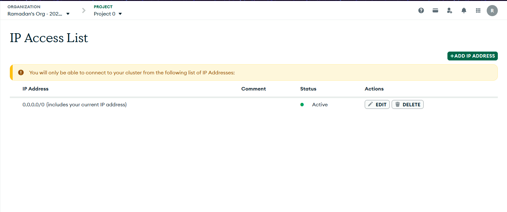
*IP Access List: 0.0.0.0/0 erlaubt Zugriff von überall*

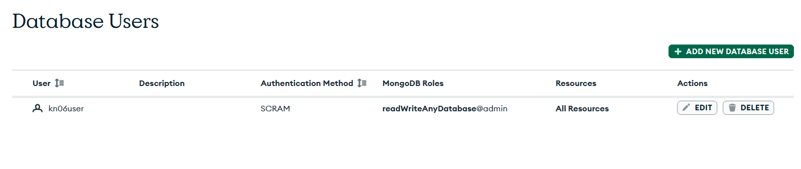
*Datenbank-User kn06user mit korrekten Berechtigungen*

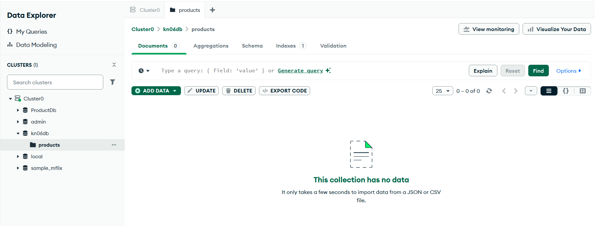
*Products Collection in MongoDB Atlas (leer, wird durch API befüllt)*

---

### 2. Web Server Installation

Eine EC2-Instanz wurde mit Cloud-Init konfiguriert:
- **Instanz-Typ:** t3.medium
- **AMI:** Ubuntu 24.04 LTS
- **Applikation:** Java Shop-Demo (läuft auf Port 5001)
- **Reverse Proxy:** Nginx (leitet Port 80 auf Port 5001 um)

**Was ist ein Reverse Proxy?**

Ein Reverse Proxy ist ein Server, der als Vermittler zwischen Clients und Backend-Servern fungiert. In diesem Setup leitet Nginx (Reverse Proxy) HTTP-Anfragen von Port 80 auf die Java-Applikation weiter, die intern auf Port 5001 läuft. Dies hat mehrere Vorteile:
- **Sicherheit:** Die echte Applikation ist nicht direkt erreichbar
- **Standardport:** Nutzer können http://IP statt http://IP:5001 verwenden
- **SSL-Terminierung:** HTTPS kann zentral verwaltet werden
- **Load Balancing:** Kann Traffic auf mehrere Backend-Server verteilen

**Beweise:**

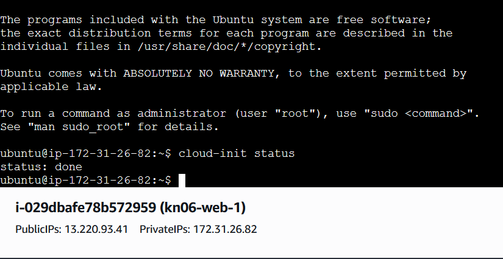
*Cloud-init status: done - Installation erfolgreich abgeschlossen*

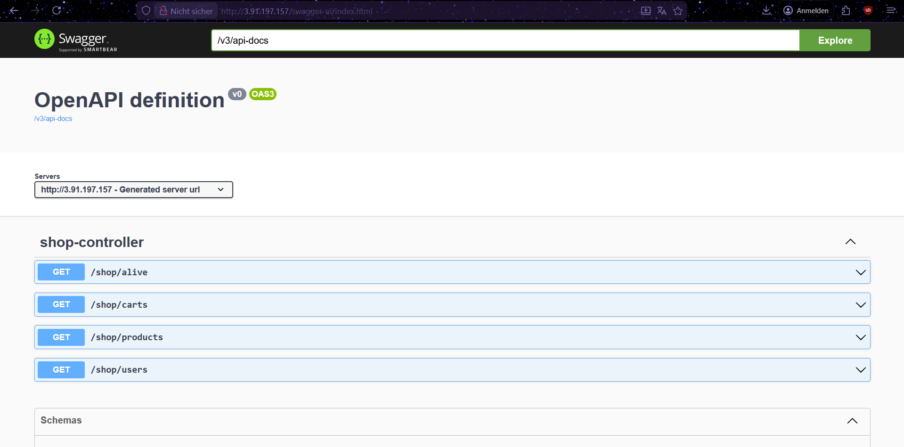
*Swagger UI ist über http://IP/swagger-ui.html erreichbar*

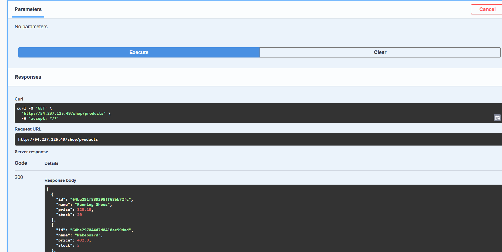
*GET /shop/products Endpoint liefert Produktdaten aus MongoDB (Status 200)*

---

### 3. Cloud-Init Analyse

**Welche Teile des Cloud-Init machen in einer produktiven Umgebung keinen Sinn?**

In einer produktiven Umgebung sind folgende Aspekte problematisch:

1. **Hardcodierte Credentials:** MongoDB-Verbindungsstring mit Passwort im Klartext im Cloud-Init Script
2. **Root-Zugriff:** `sudo`-Befehle ohne Einschränkungen könnten Sicherheitsrisiken darstellen
3. **Fehlende Fehlerbehandlung:** Keine Überprüfung, ob Downloads oder Installationen erfolgreich waren
4. **Logs im Klartext:** Sensitive Informationen könnten in `/var/log/cloud-init-output.log` landen
5. **Keine Secrets-Verwaltung:** Passwörter sollten über AWS Secrets Manager oder Parameter Store verwaltet werden
6. **Automatische Updates deaktiviert:** Sicherheitsupdates sollten automatisch installiert werden

**Bessere Lösung für Produktion:**
- Secrets in AWS Systems Manager Parameter Store
- Application Configuration über Umgebungsvariablen
- Monitoring und Logging mit CloudWatch
- Regelmäßige Security Patches

---

## B) Vertikale Skalierung (10%)

### 1. Disk-Erweiterung auf 20GB

Das Root-Volume wurde von 8 GiB auf 20 GiB erweitert.

**Vorher-Nachher:**

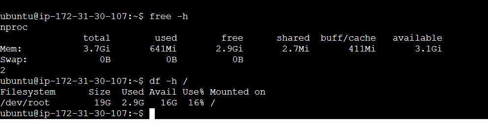
*Volume ist bereits auf 20 GiB erweitert - `df -h` zeigt 16G verfügbar auf /dev/root*

**Durchgeführte Schritte:**
1. EC2 Console → Instances → Instance auswählen
2. Storage Tab → Volume-ID anklicken
3. Actions → Modify Volume → Size auf 20 GiB erhöhen
4. Warten bis Modification abgeschlossen (2-3 Minuten)
5. SSH zur Instanz: `sudo growpart /dev/xvda 1` (falls nötig)
6. Dateisystem erweitern: `sudo resize2fs /dev/xvda1`

**Geht dies im laufenden Betrieb?**

**Ja!** Die Disk-Erweiterung bei AWS EBS-Volumes kann im laufenden Betrieb durchgeführt werden:
- Die Instanz muss **nicht** gestoppt werden
- Der Service läuft **ohne Unterbrechung** weiter
- Nur das Dateisystem muss nach der Volume-Erweiterung angepasst werden
- **Vorteil:** Zero-Downtime Skalierung

---

### 2. Instanztyp-Änderung

Die Instanz läuft bereits als **t3.medium** mit:
- **2 vCPUs**
- **4 GiB RAM**

**Geht eine Instanztyp-Änderung im laufenden Betrieb?**

**Nein!** Eine Änderung des Instanztyps erfordert:
1. Instanz **stoppen**
2. Actions → Instance Settings → Change Instance Type
3. Neuen Typ auswählen (z.B. t3.medium → t3.large)
4. Instanz wieder **starten**

**Downtime:** Ca. 2-5 Minuten (Stop + Typ ändern + Start)

**Für Zero-Downtime:** Horizontale Skalierung mit Load Balancer verwenden (siehe Teil C)

---

## C) Horizontale Skalierung (20%)

### 1. Zweite Instanz erstellen

Eine zweite Instanz wurde aus dem AMI `kn06-web-ami` erstellt:
- **Name:** kn06-web-2
- **Instanztyp:** t3.medium
- **AMI:** kn06-web-ami
- **Sicherheitsgruppe:** launch-wizard-6

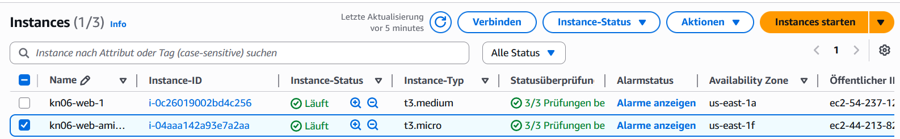
*Beide Instanzen (kn06-web-1 und kn06-web-2) laufen und sind healthy*

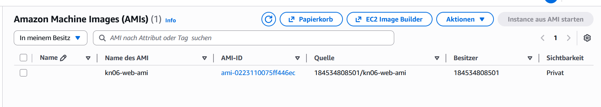
*Selbst erstelltes AMI als Basis für weitere Instanzen*

---

### 2. Application Load Balancer erstellen

Ein Application Load Balancer wurde konfiguriert:
- **Name:** kn06-load-balancer
- **Scheme:** Internet-facing
- **Availability Zones:** us-east-1a, us-east-1f
- **Sicherheitsgruppe:** launch-wizard-6
- **Listener:** HTTP Port 80

---

### 3. Target Group konfigurieren

Eine Target Group verbindet Load Balancer mit Instanzen:
- **Name:** kn06-target-group
- **Protocol:** HTTP:80
- **Health Check Path:** `/swagger-ui.html`
- **Targets:** kn06-web-1, kn06-web-2

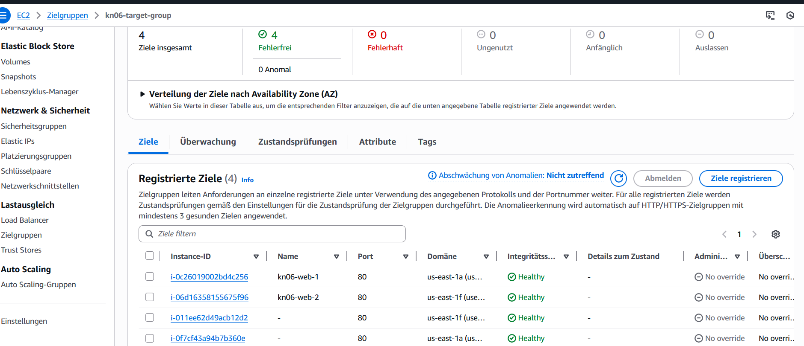
*Alle 4 Targets sind healthy (2 manuelle + 2 Auto Scaling Instanzen)*

---

### 4. Load Balancer testen

Der Load Balancer verteilt Traffic auf beide Instanzen:

**DNS-Name:** `kn06-load-balancer-1465508545.us-east-1.elb.amazonaws.com`

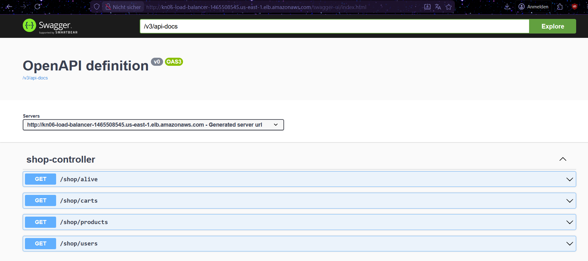
*Swagger UI über Load Balancer erreichbar - URL zeigt Load Balancer DNS*

**Test erfolgreich:**
- ✅ Swagger UI erreichbar über Load Balancer
- ✅ API-Endpoints funktionieren
- ✅ Load Balancer verteilt Traffic auf alle healthy Targets

---

### 5. DNS-Konfiguration für `app.tbz-m346.ch`

**Frage:** Wie müsste der DNS konfiguriert werden, damit die Applikation unter `app.tbz-m346.ch` erreichbar ist?

**Antwort:**

Um die Applikation unter einer eigenen Domain verfügbar zu machen, muss ein **CNAME-Record** im DNS erstellt werden:

**DNS-Konfiguration:**
```
Type: CNAME
Name: app.tbz-m346.ch
Value: kn06-load-balancer-1465508545.us-east-1.elb.amazonaws.com
TTL: 300 (5 Minuten)
```

**Schritte:**
1. Bei DNS-Provider (z.B. Cloudflare, Route53) anmelden
2. DNS-Zone für `tbz-m346.ch` auswählen
3. Neuen CNAME-Record erstellen:
   - **Name:** `app`
   - **Ziel:** Load Balancer DNS-Name
4. Speichern und auf Propagierung warten (5-30 Minuten)

**Alternativ mit Route53 (AWS):**
- **A-Record mit Alias** verwenden statt CNAME
- Vorteil: Keine zusätzlichen Kosten, bessere Performance
- AWS Route53 → Create Record → Alias → Target: Application Load Balancer

**Nach DNS-Konfiguration:**
- Applikation erreichbar unter: `http://app.tbz-m346.ch`
- Load Balancer verteilt Traffic automatisch
- Health Checks stellen sicher, dass nur gesunde Instanzen Traffic bekommen

---

## D) Auto Scaling (20%)

### 1. Launch Template erstellen

Ein Launch Template definiert die Konfiguration für neue Instanzen:
- **Name:** kn06-launch-template
- **AMI:** kn06-web-ami
- **Instance Type:** t3.medium
- **Key Pair:** kn06-.key
- **Security Group:** launch-wizard-6

**Zweck:** Auto Scaling Group verwendet dieses Template, um automatisch neue Instanzen zu starten.

---

### 2. Auto Scaling Group erstellen

Die Auto Scaling Group verwaltet die Anzahl der Instanzen automatisch:
- **Name:** kn06-auto-scaling-group
- **Launch Template:** kn06-launch-template
- **Gewünschte Kapazität:** 2 Instanzen
- **Minimum:** 2 Instanzen
- **Maximum:** 5 Instanzen
- **VPC & Subnets:** us-east-1a, us-east-1f
- **Load Balancer:** kn06-target-group
- **Health Checks:** EC2 + ELB
- **Health Check Grace Period:** 300 Sekunden

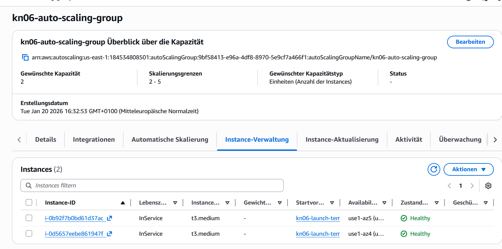
*Auto Scaling Group mit 2 Instanzen (InService, Healthy) in unterschiedlichen Availability Zones*

---

### 3. Auto Scaling testen

**Test:** Alte manuelle Instanzen wurden gestoppt, um zu prüfen, ob Auto Scaling neue Instanzen startet.

**Ergebnis:**
- ✅ Auto Scaling hat **automatisch** auf den Ausfall reagiert
- ✅ Neue Instanzen wurden gestartet
- ✅ Nach 5-8 Minuten waren neue Instanzen "Healthy"
- ✅ Load Balancer hat Traffic nur zu gesunden Instanzen geleitet

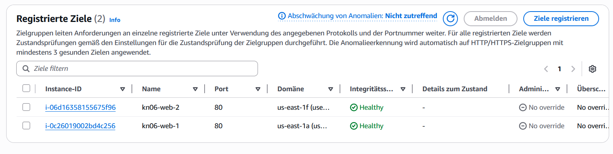
*Target Group zeigt 2 gesunde Targets aus der Auto Scaling Group*

**Auto Scaling funktioniert:**
- Bei Ausfall einer Instanz startet Auto Scaling automatisch eine neue
- Minimum von 2 Instanzen wird immer aufrechterhalten
- Bei erhöhter Last können bis zu 5 Instanzen gestartet werden
- Health Checks stellen sicher, dass nur funktionsfähige Instanzen Traffic bekommen

---

## Zusammenfassung

### Erstellte Ressourcen:
- ✅ MongoDB Atlas Cluster (SaaS)
- ✅ EC2-Instanzen mit Java Shop-API
- ✅ AMI (kn06-web-ami)
- ✅ Application Load Balancer (kn06-load-balancer)
- ✅ Target Group (kn06-target-group)
- ✅ Launch Template (kn06-launch-template)
- ✅ Auto Scaling Group (kn06-auto-scaling-group)

### Skalierung implementiert:
- ✅ **Vertikal:** Disk auf 20GB erweitert, t3.medium Instanztyp
- ✅ **Horizontal:** Load Balancer mit mehreren Instanzen
- ✅ **Automatisch:** Auto Scaling Group (Min: 2, Max: 5)

### Funktionen getestet:
- ✅ Swagger UI über Load Balancer erreichbar
- ✅ API-Endpoints liefern Daten aus MongoDB
- ✅ Health Checks funktionieren
- ✅ Auto Scaling ersetzt ausgefallene Instanzen automatisch
- ✅ Load Balancer verteilt Traffic auf gesunde Instanzen

---

## Leitfragen beantwortet

✅ **Reverse Proxy:** Nginx leitet Port 80 auf interne Applikation (Port 5001) um - ermöglicht Standard-HTTP-Zugriff, Sicherheit und zentrale SSL-Verwaltung

✅ **Services verwalten:** `systemctl start/stop/restart/status shop-app.service`

✅ **Vertikale Skalierung:** Disk-Erweiterung im laufenden Betrieb möglich, Instanztyp-Änderung erfordert Neustart (2-5 Min Downtime)

✅ **Horizontale Skalierung:** Load Balancer verteilt Traffic auf mehrere Instanzen - Zero-Downtime Skalierung möglich

✅ **Auto Scaling:** Automatisches Starten/Stoppen von Instanzen basierend auf Anzahl oder Metriken (CPU, Memory)

✅ **MongoDB Atlas:** SaaS-Datenbank ohne eigenen Server, IP-Zugriff über Access List gesteuert

✅ **Cloud-Init:** Automatisierte Instance-Konfiguration beim Start - für komplexe Setups geeignet