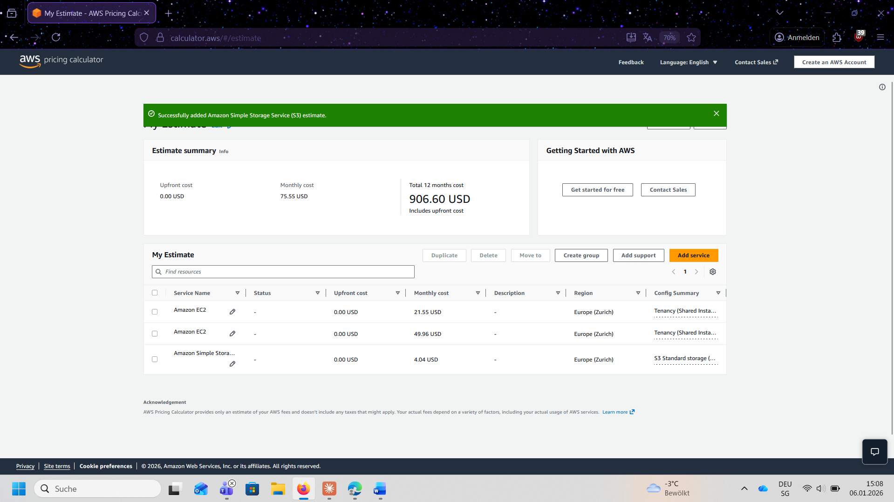
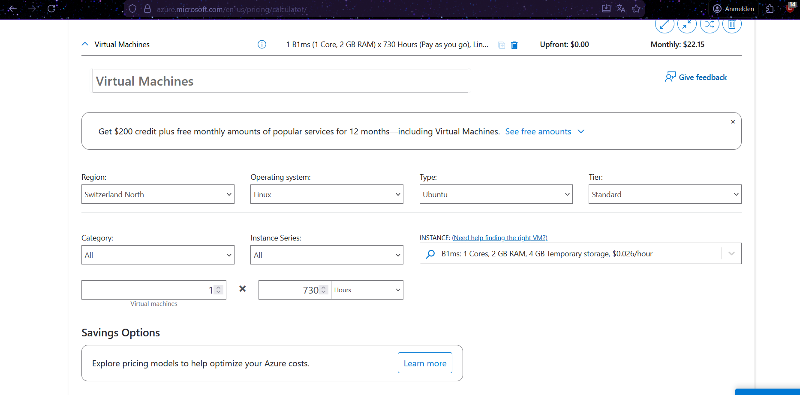
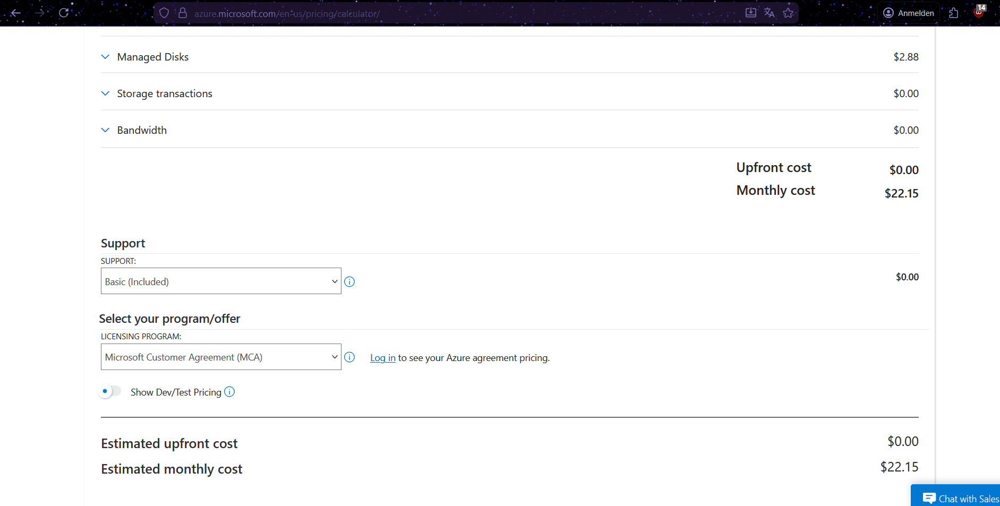
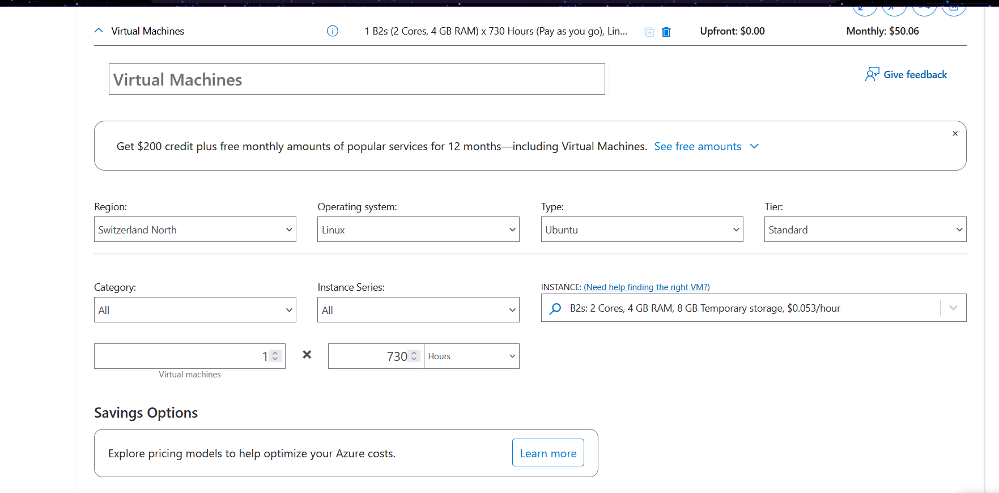
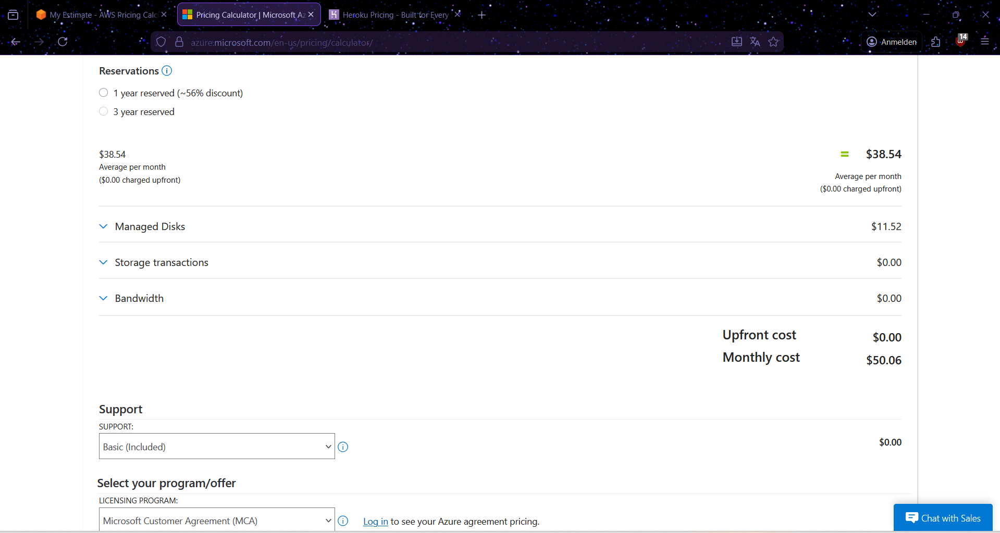
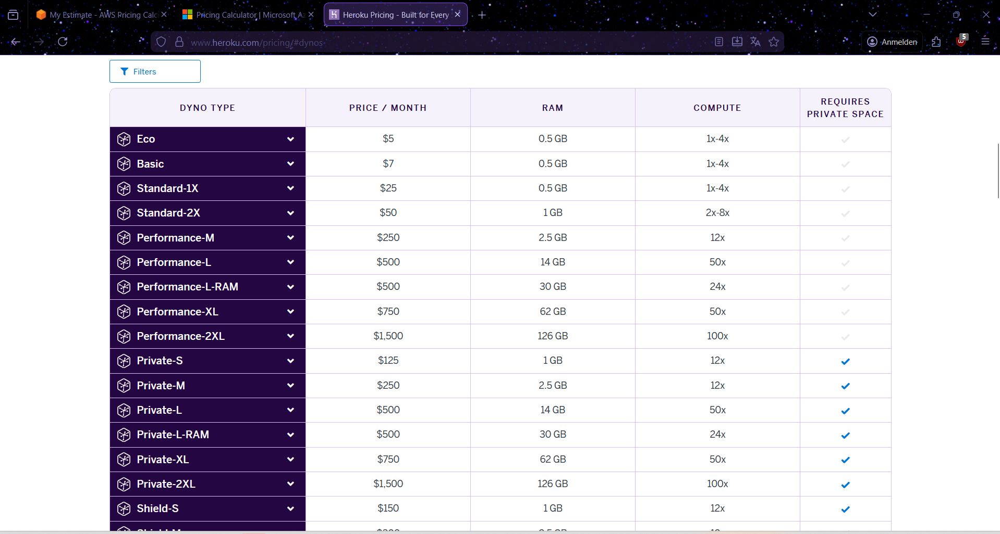
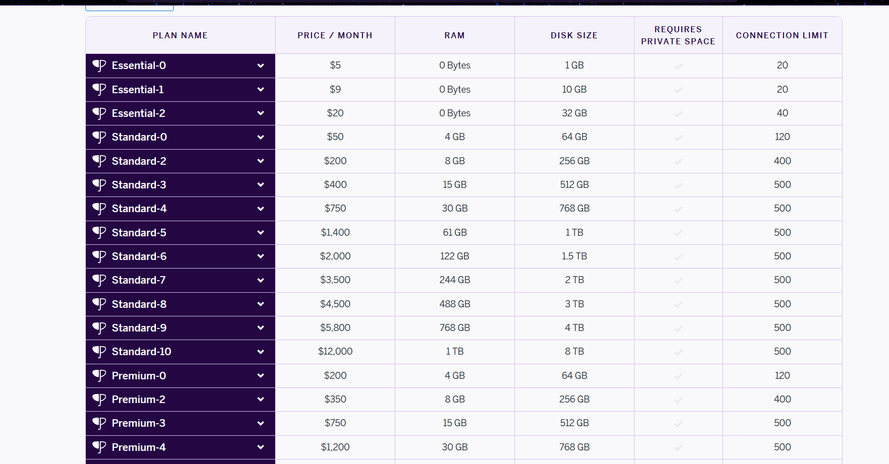
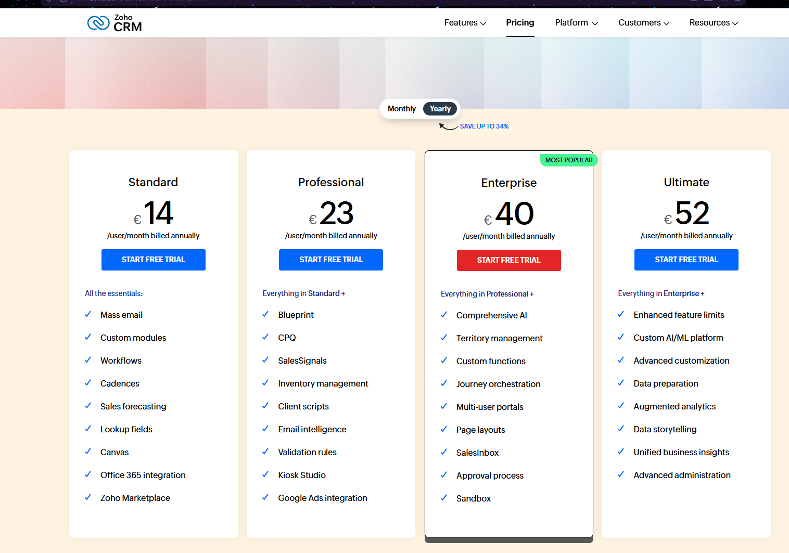
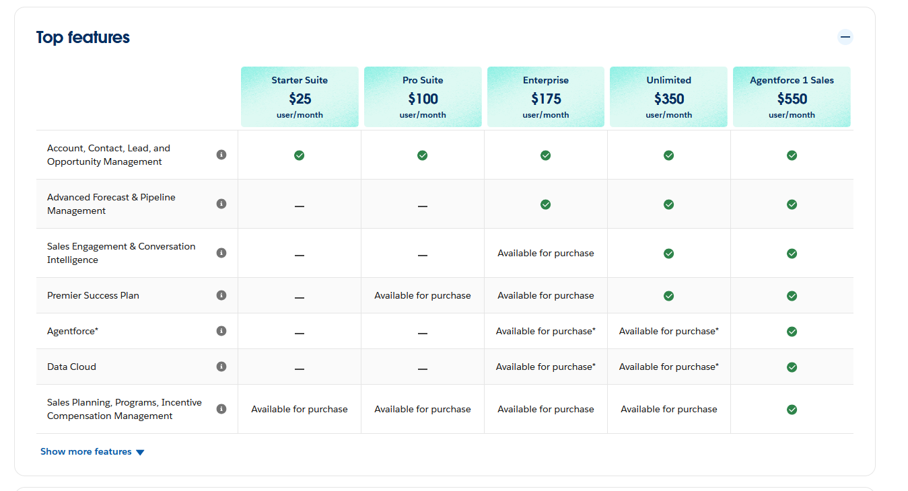

# KN10 - Kostenberechnung Cloud-Migration

---

## Teil A: IAAS - Infrastructure as a Service

### A.1 Amazon Web Services (AWS)

#### Komponentenauswahl und Begründung

**Web-Server (EC2 t3.small):**
Für den Web-Server wurde eine EC2 t3.small Instance gewählt (2 vCPUs, 2 GB RAM). Die t3-Serie bietet Burst-Kapazität für variable Workloads. Betriebssystem: Ubuntu Linux. Speicher: 20 GB EBS gp3.

**Datenbank-Server (EC2 t3.medium):**
Die t3.medium Instance bietet 2 vCPUs und 4 GB RAM. Mit 100 GB EBS gp3 Storage ist genügend Platz für die Datenbank vorhanden.

**Backup Storage (S3):**
Amazon S3 Standard für ca. 150 GB Backup-Daten (tägliche, wöchentliche, monatliche Backups).

#### AWS Kostenübersicht

| Komponente | Monatliche Kosten |
|------------|-------------------|
| EC2 Web-Server (t3.small) | $21.55 |
| EC2 DB-Server (t3.medium) | $49.96 |
| S3 Backup (150 GB) | $4.04 |
| **Total AWS** | **$75.55/Monat** |

---

### A.2 Microsoft Azure

#### Komponentenauswahl und Begründung

**Web-Server (B1ms):**
Azure B1ms VM mit 1 vCPU und 2 GB RAM. Region: Switzerland North. Standard SSD Managed Disk 32 GB (E4).

**Datenbank-Server (B2s):**
Azure B2s VM mit 2 vCPUs und 4 GB RAM. Standard SSD Managed Disk 128 GB (E10). Redundanz: LRS.

#### Azure Kostenübersicht

| Komponente | Monatliche Kosten |
|------------|-------------------|
| VM Web-Server (B1ms + 32GB SSD) | $22.15 |
| VM DB-Server (B2s + 128GB SSD) | $50.06 |
| **Total Azure** | **$72.21/Monat** |

---

## Teil B: PAAS - Platform as a Service

### Heroku

#### Komponentenauswahl und Begründung

**Web-Server (Dyno Standard-1X):**
Standard-1X Dyno für $25/Monat. Bei PAAS muss man sich nicht um Betriebssystem, Updates oder Server-Konfiguration kümmern.

**Datenbank (Heroku Postgres Standard-0):**
Heroku Postgres Standard-0 für $50/Monat mit 4 GB RAM, 64 GB Speicher und 120 Verbindungen.

#### Heroku Kostenübersicht

| Komponente | Monatliche Kosten |
|------------|-------------------|
| Dyno Standard-1X (Web) | $25.00 |
| Postgres Standard-0 (DB) | $50.00 |
| **Total Heroku** | **$75.00/Monat** |

---

## Teil C: SAAS - Software as a Service

### C.1 Zoho CRM

Zoho CRM Professional Plan (€23/Benutzer/Monat) mit Sales Signals, Inventory Management und E-Mail-Intelligence.

**Zoho CRM Kosten:** 30 Benutzer × €23 = **€690/Monat** (~$750)

### C.2 Salesforce Sales Cloud

Salesforce Starter Suite ($25/Benutzer/Monat) mit Lead, Account, Contact und Opportunity Management.

**Salesforce Kosten:** 30 Benutzer × $25 = **$750/Monat**

---

## Teil D: Interpretation und Vergleich

### Kostenvergleich

| Anbieter | Typ | Monatliche Kosten |
|----------|-----|-------------------|
| AWS | IAAS | $75.55 |
| Azure | IAAS | $72.21 |
| Heroku | PAAS | $75.00 |
| Zoho CRM | SAAS | ~$750 |
| Salesforce | SAAS | $750 |

### Analyse

**Kosten:** IAAS/PAAS (~$72-76/Monat) sind deutlich günstiger als SAAS (~$750/Monat), da SAAS pro Benutzer abrechnet.

**Aufwand:** Bei IAAS muss das Unternehmen alles selbst verwalten (Updates, Patches, Backups). Bei PAAS übernimmt die Plattform vieles. Bei SAAS ist der Aufwand minimal.

**Empfehlung:** Ohne IT-Abteilung → SAAS (Zoho/Salesforce). Mit IT-Expertise → IAAS (Azure wegen Schweizer Region).

**Fazit:** Azure bietet das beste Preis-Leistungs-Verhältnis bei IAAS ($72.21/Monat) mit Schweizer Rechenzentrum.
